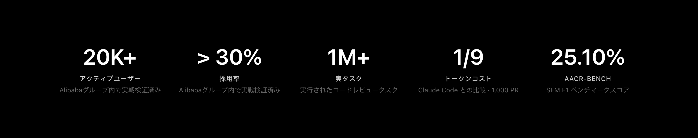
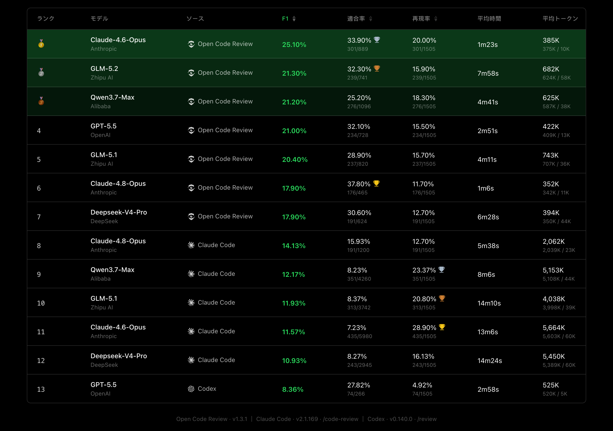

<div align="center">
  <a href="https://open-codereview.ai">
    
  </a>
  <h1>OpenCodeReview</h1>
</div>

<p align="center">
  <a href="https://trendshift.io/repositories/41087?utm_source=repository-badge&amp;utm_medium=badge&amp;utm_campaign=badge-repository-41087" target="_blank" rel="noopener noreferrer">
    
  </a>
  <a href="https://trendshift.io/repositories/41087" target="_blank">
    
  </a>
</p>
<p align="center">
  <a href="https://www.npmjs.com/package/@alibaba-group/open-code-review"></a>
  <a href="https://github.com/alibaba/open-code-review/actions/workflows/release.yml"></a>
  <a href="https://github.com/alibaba/open-code-review/blob/main/LICENSE"></a>
  <a href="https://deepwiki.com/alibaba/open-code-review"></a>
  <a href="https://www.bestpractices.dev/projects/13328"></a>
</p>
<p align="center">
  <a href="#supported-platforms"></a>
  <a href="#supported-platforms"></a>
  <a href="#supported-platforms"></a>
  <a href="#supported-agents"></a>
  <a href="#supported-agents"></a>
  <a href="#supported-agents"></a>
</p>
<p align="center">
  <a href="README.md">English</a> | <a href="README.zh-CN.md">简体中文</a> | 日本語 | <a href="README.ko-KR.md">한국어</a> | <a href="README.ru-RU.md">Русский</a>
</p>

---

## Open Code Reviewとは？

Open Code ReviewはAIを活用したコードレビューCLIツールです。もともとはAlibaba Group社内の公式AIコードレビューアシスタントとして誕生し、過去2年間で数万人の開発者にサービスを提供し、数百万件のコード欠陥を発見してきました。大規模な環境で徹底的に検証された後、コミュニティ向けのオープンソースプロジェクトとして公開されました。モデルのエンドポイントを設定するだけで使い始められます。

Gitのdiffを読み取り、変更されたファイルをツール利用機能を持つエージェント経由で設定可能なLLMに送信し、行レベルの精度で構造化されたレビューコメントを生成します。エージェントはファイル全体の内容を読み取り、コードベースを検索し、コンテキストのために他の変更ファイルを参照し、深いレビューを生成できます — 単なる表面的なdiffへのフィードバックではありません。diffレビュー以外にも、`ocr scan` はファイル全体をレビューできます。不慣れなコードベースの監査や、意味のあるdiffがないディレクトリの検査に便利です。

詳細は[公式サイト](https://open-codereview.ai)をご覧ください。



## ベンチマーク

> 汎用エージェント（Claude Code）と比較して、Open Code Reviewは同じ基盤モデルで有意に高い**精度（Precision）**と**F1スコア**を達成し、トークン消費量は**約1/9**にとどまり、レビューもより高速です。ただし、リコール（Recall）は汎用エージェントより低くなります——これはノイズを抑え精度を優先する設計上のトレードオフです。

実際のコードレビューに基づくベンチマーク。**50**の人気オープンソースリポジトリから**200**の実際のPull Requestを厳選し、**10**のプログラミング言語をカバー——80人以上のシニアエンジニアによるクロスバリデーション（**1,505**件のアノテーション済み欠陥）。

| 指標 | 測定内容 | 重要性 |
|------|----------|--------|
| **F1** | 精度とリコールの調和平均 | レビュー品質を示す最良の単一指標 |
| **精度 (Precision)** | 報告された問題のうち実際の欠陥の割合 | 高い = 確認すべき偽陽性が少ない |
| **リコール (Recall)** | 実際の欠陥のうち発見された割合 | 高い = 見逃しが少ない |
| **平均時間 (Avg Time)** | レビューあたりの実時間 | CIパイプラインの待機時間に影響 |
| **平均トークン (Avg Token)** | レビューあたりの総トークン消費量 | APIコストに直接影響 |



## なぜOpen Code Reviewなのか？

### 汎用エージェントの問題点

Claude CodeのSkillsのような汎用エージェントをコードレビューに使ったことがあれば、次のような課題に直面したことがあるはずです：

- **不完全なカバレッジ** — 大きな変更セットでは、エージェントが「手を抜き」、一部のファイルだけを選択的にレビューして他を見落としがちです。
- **位置のずれ** — 報告された問題が実際のコード位置と一致せず、行番号やファイル参照がターゲットからずれることが頻繁にあります。
- **不安定な品質** — 自然言語駆動のSkillsはデバッグが難しく、わずかなプロンプトの違いでレビュー品質が大きく変動します。

根本原因は、純粋に言語駆動のアーキテクチャにはレビュープロセスに対するハードな制約が欠けていることです。

### コア設計: 決定論的エンジニアリング × エージェントのハイブリッド

Open Code Reviewのコア哲学は、決定論的エンジニアリングとエージェントを組み合わせ、それぞれが得意とする領域を担当させることです。

**決定論的エンジニアリング — ハードな制約**

*絶対に間違えてはならない*レビューステップについては、言語モデルではなくエンジニアリングロジックが正しさを保証します：

- **正確なファイル選択** — どのファイルをレビューし、どのファイルをフィルタリングすべきかを正確に決定し、重要な変更が見落とされないようにします。
- **スマートなファイルバンドル** — 関連するファイルを単一のレビューユニットにグループ化します（例：`message_en.properties`と`message_zh.properties`はまとめてバンドルされます）。各バンドルは分離されたコンテキストを持つサブエージェントとして実行されます — 非常に大きな変更セットでも安定する分割統治戦略で、自然に並行レビューもサポートします。
- **きめ細かなルールマッチング** — 各ファイルの特性に応じてレビュールールをマッチングし、モデルの注意を鋭く集中させ、情報ノイズを発生源から排除します。純粋に言語駆動のルール誘導と比べて、テンプレートエンジンベースのルールマッチングはより安定的で予測可能です。
- **外部の位置特定・リフレクションモジュール** — 独立したコメント位置特定モジュールとコメントリフレクションモジュールにより、AIフィードバックの位置精度と内容精度の両方を体系的に向上させます。

**エージェント — 動的な意思決定**

エージェントの強みは、最も重要な領域 — 動的な意思決定と動的なコンテキスト取得 — に集中させています：

- **シナリオに最適化されたプロンプト** — コードレビュー向けに深く最適化されたプロンプトテンプレートにより、効果を高めつつトークン消費を削減します。
- **シナリオに最適化されたツールセット** — 大規模な本番データにおけるツール呼び出しトレースの詳細な分析 — 呼び出し頻度の分布、ツールごとの繰り返し率、新しいツールが呼び出しチェーン全体に与える影響など — から抽出された、汎用エージェントツールキットよりもコードレビューにおいて安定的で予測可能な専用ツールセットです。

## 使い方

### 前提条件

- **Git >= 2.41** — Open Code Review は diff 生成、コード検索、リポジトリ操作に Git を利用します。

### CLI

#### インストール

```bash
npm install -g @alibaba-group/open-code-review
```

インストール後、`ocr`コマンドがグローバルに利用可能になります。

その他のインストール方法（インストールスクリプト、GitHub Release バイナリ、ソースビルド）については、[インストールガイド](https://open-codereview.ai/docs/installation)を参照してください。

#### クイックスタート

**1. LLMの設定**

コードレビューの前にLLMの設定が必要です。[デリゲートモード](https://open-codereview.ai/docs/delegate)を使用する場合は不要です。

```bash
ocr config provider          # ビルトインプロバイダーを選択またはカスタムプロバイダーを追加
ocr config model             # アクティブなプロバイダーのモデルを選択
```


対話的UIがプロバイダーの選択、APIキーの入力、モデル設定をガイドし、完了後に自動的に接続テストを行います。

CLIセットアップ、環境変数、カスタムプロバイダーなどの高度な設定については、[設定ガイド](https://open-codereview.ai/docs/configuration)を参照してください。

**2. レビュー**

```bash
cd your-project

# ワークスペースモード — ステージ済み・未ステージ・未追跡のすべての変更をレビュー
ocr review

# ブランチ範囲 — 2つのrefを比較
ocr review --from main --to feature-branch

# 単一コミット
ocr review --commit abc123

# 中断した範囲または単一 commit レビューを再開
ocr session list
ocr review --from main --to feature-branch --resume <session-id>

# フルファイルスキャン — diffではなくファイル全体をレビュー（git履歴不要）
ocr scan                          # リポジトリ全体をスキャン
ocr scan --path internal/agent    # ディレクトリまたは特定のファイルをスキャン

# デリゲートモード — AI コーディングエージェントが自らレビューを実行
# OCR はファイル選択とルール解決を担当。LLM 設定不要
ocr delegate preview
ocr delegate rule src/main.go src/handler.go
```

## ドキュメント

完全なドキュメントは **[open-codereview.ai/docs](https://open-codereview.ai/docs)** にあります：

- [クイックスタート](https://open-codereview.ai/docs/quickstart) — インストールして最初のレビューを実行
- [インストール](https://open-codereview.ai/docs/installation) — すべてのプラットフォームとパッケージマネージャー
- [CLI リファレンス](https://open-codereview.ai/docs/cli-reference) — すべてのコマンドとフラグ
- [レビュールール](https://open-codereview.ai/docs/review-rules) — レビュールールのカスタマイズ、パスフィルタリングとターゲティング
- [設定](https://open-codereview.ai/docs/configuration) — 設定キーと環境変数
- [MCP サーバー](https://open-codereview.ai/docs/mcp) — 外部ツールでレビューエージェントを拡張
- コーディングエージェント連携 — OCR を Claude Code、Codex、Cursor などに統合
  - [Skill](https://open-codereview.ai/docs/agent-skill) — 再利用可能なエージェントスキルとしてインストール
  - [Plugin](https://open-codereview.ai/docs/claude-code) — Claude Code / Codex / Cursor プラグインとしてインストール
  - [デリゲートモード](https://open-codereview.ai/docs/delegate) — エージェント自身の LLM でレビューを実行
- [CI/CD 連携](https://open-codereview.ai/docs/cicd) — GitHub Actions、GitLab CI、GitFlic CI、Gerrit との統合
- [セッションビューアー](https://open-codereview.ai/docs/viewer) — ブラウザでレビューセッションを閲覧・再生
- [テレメトリー](https://open-codereview.ai/docs/telemetry) — 可観測性のためのOpenTelemetry統合
- [FAQ](https://open-codereview.ai/docs/faq) — よくある質問とトラブルシューティング

## コントリビューション

このプロジェクトは、貢献してくださるすべての方々のおかげで成り立っています。開発環境のセットアップ、コーディングガイドライン、プルリクエストの提出方法については[CONTRIBUTING.md](CONTRIBUTING.md)を参照してください。

<a href="https://github.com/alibaba/open-code-review/graphs/contributors">
  
</a>

## ライセンス

[Apache-2.0](LICENSE) — Copyright 2026 Alibaba
