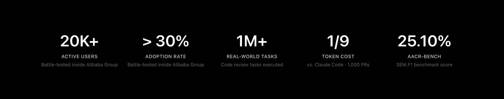
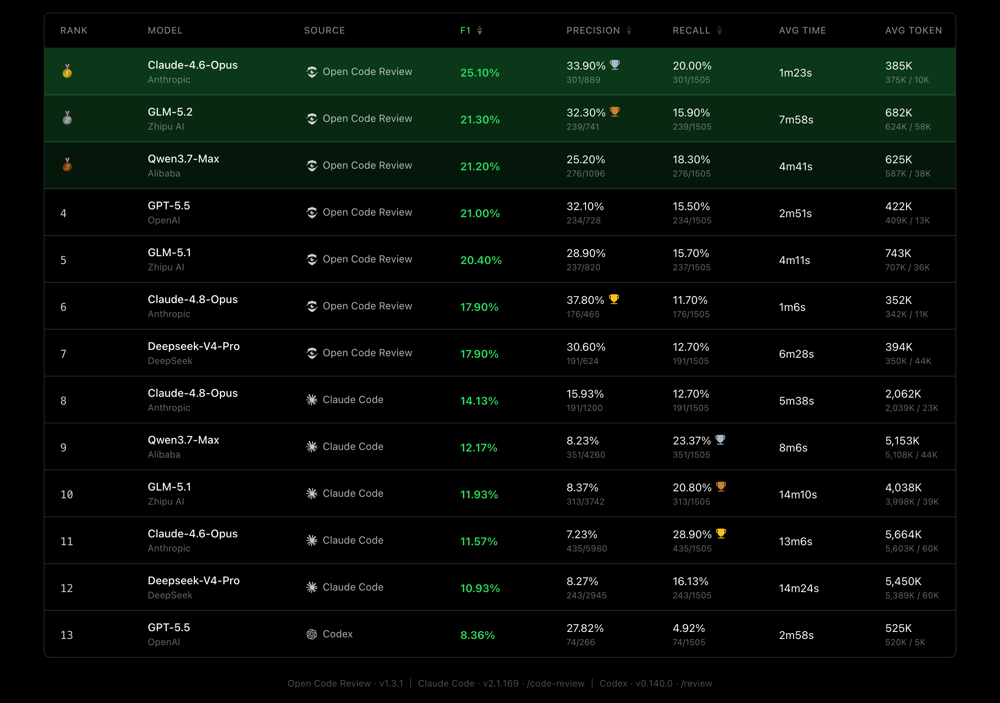
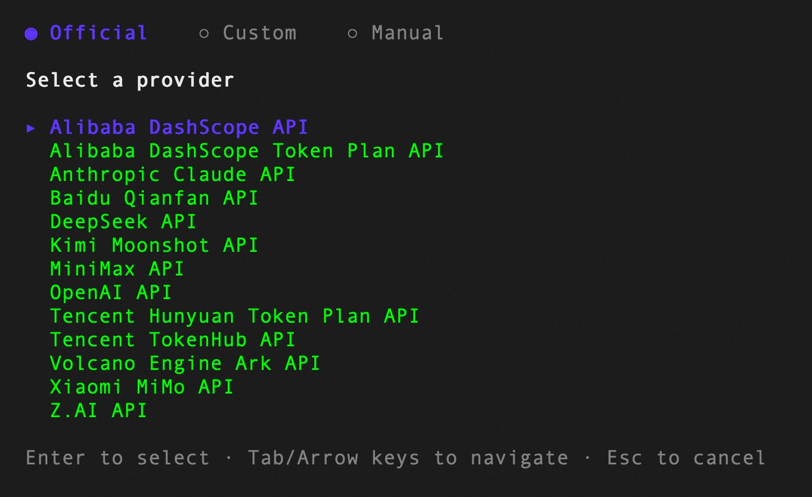

<div align="center">
  <a href="https://open-codereview.ai">
    
  </a>
  <h1>OpenCodeReview</h1>
</div>

<p align="center">
  <a href="https://trendshift.io/repositories/41087?utm_source=repository-badge&amp;utm_medium=badge&amp;utm_campaign=badge-repository-41087" target="_blank" rel="noopener noreferrer">
    
  </a>
  <a href="https://trendshift.io/repositories/41087" target="_blank">
    
  </a>
</p>
<p align="center">
  <a href="https://www.npmjs.com/package/@alibaba-group/open-code-review"></a>
  <a href="https://github.com/alibaba/open-code-review/actions/workflows/release.yml"></a>
  <a href="https://github.com/alibaba/open-code-review/blob/main/LICENSE"></a>
  <a href="https://deepwiki.com/alibaba/open-code-review"></a>
  <a href="https://www.bestpractices.dev/projects/13328"></a>
</p>
<p align="center">
  <a href="#supported-platforms"></a>
  <a href="#supported-platforms"></a>
  <a href="#supported-platforms"></a>
  <a href="#supported-agents"></a>
  <a href="#supported-agents"></a>
  <a href="#supported-agents"></a>
</p>
<p align="center">
  <a href="README.md">English</a> | <a href="README.zh-CN.md">简体中文</a> | <a href="README.ja-JP.md">日本語</a> | 한국어 | <a href="README.ru-RU.md">Русский</a>
</p>

---

## Open Code Review란?

Open Code Review는 AI 기반 코드 리뷰 CLI 도구입니다. Alibaba Group의 내부 공식 AI 코드 리뷰 어시스턴트에서 시작했으며, 지난 2년 동안 수만 명의 개발자에게 제공되어 수백만 건의 코드 결함을 찾아냈습니다. 대규모 환경에서 충분히 검증한 뒤 커뮤니티를 위해 오픈 소스 프로젝트로 공개했습니다. 모델 endpoint만 설정하면 바로 사용할 수 있습니다.

이 도구는 Git diff를 읽고, 변경 파일을 tool-use 기능을 가진 agent를 통해 설정 가능한 LLM으로 전달한 뒤, 라인 단위 위치 정보가 포함된 구조화된 리뷰 코멘트를 생성합니다. agent는 전체 파일 내용 읽기, 코드베이스 검색, 다른 변경 파일 확인 등을 통해 맥락을 확보하고 표면적인 diff 피드백이 아닌 깊이 있는 리뷰를 수행할 수 있습니다. diff 리뷰 외에도 `ocr scan`은 전체 파일을 리뷰할 수 있어, 익숙하지 않은 코드베이스를 감사하거나 의미 있는 diff가 없는 디렉터리를 검토하는 데 유용합니다.

자세한 내용은 [공식 웹사이트](https://open-codereview.ai)를 참조하세요.



## 벤치마크

> 범용 Agent(Claude Code)와 비교할 때, Open Code Review는 동일한 기반 모델에서 유의미하게 높은 **정밀도(Precision)**와 **F1 점수**를 달성하며, 토큰 소비량은 **약 1/9** 수준이고 리뷰 속도도 더 빠릅니다. 다만 재현율(Recall)은 범용 Agent보다 낮습니다 — 이는 노이즈를 줄이고 정밀도를 우선하는 설계적 트레이드오프입니다.

실제 코드 리뷰 기반 벤치마크. **50**개 인기 오픈소스 저장소에서 **200**개 실제 Pull Request를 엄선하고, **10**개 프로그래밍 언어를 커버 — 80명 이상의 시니어 엔지니어가 교차 검증(**1,505**개 어노테이션된 결함).

| 지표 | 측정 내용 | 중요한 이유 |
|------|-----------|-------------|
| **F1** | 정밀도와 재현율의 조화 평균 | 리뷰 품질을 나타내는 최적의 단일 지표 |
| **정밀도 (Precision)** | 보고된 이슈 중 실제 결함 비율 | 높을수록 확인할 오탐이 적음 |
| **재현율 (Recall)** | 실제 결함 중 발견된 비율 | 높을수록 놓치는 이슈가 적음 |
| **평균 시간 (Avg Time)** | 리뷰당 실제 소요 시간 | CI 파이프라인 대기 시간에 영향 |
| **평균 토큰 (Avg Token)** | 리뷰당 총 토큰 소비량 | API 비용에 직접 영향 |



## 왜 Open Code Review인가?

### 범용 Agent의 문제

Claude Code Skills 같은 범용 agent로 코드 리뷰를 해봤다면 다음 문제를 경험했을 수 있습니다.

- **불완전한 커버리지**: 큰 changeset에서는 일부 파일만 선택적으로 리뷰하고 중요한 파일을 놓치기 쉽습니다.
- **위치 드리프트**: 지적된 문제가 실제 코드 위치와 맞지 않거나 라인 번호와 파일 참조가 어긋나는 일이 자주 발생합니다.
- **불안정한 품질**: 자연어 기반 Skill은 디버깅이 어렵고, 작은 prompt 변화에도 리뷰 품질이 크게 흔들릴 수 있습니다.

근본 원인은 순수 언어 중심 아키텍처가 리뷰 프로세스에 강한 제약을 제공하지 못한다는 점입니다.

### 핵심 설계: 결정적 엔지니어링과 Agent의 하이브리드

Open Code Review의 핵심 철학은 결정적 엔지니어링과 agent를 결합해 각자가 가장 잘하는 일을 맡기는 것입니다.

**결정적 엔지니어링: 강한 제약**

반드시 정확해야 하는 리뷰 단계는 언어 모델이 아니라 엔지니어링 로직이 보장합니다.

- **정확한 파일 선택**: 어떤 파일을 리뷰하고 어떤 파일을 필터링할지 결정해 중요한 변경이 누락되지 않도록 합니다.
- **스마트 파일 번들링**: 관련 파일을 하나의 리뷰 단위로 묶습니다. 예를 들어 `message_en.properties`와 `message_zh.properties`를 함께 묶습니다. 각 번들은 독립된 context를 가진 sub-agent로 실행되며, 대규모 changeset에서도 안정적인 divide-and-conquer 전략과 동시 리뷰를 지원합니다.
- **세밀한 rule 매칭**: 각 파일의 특성에 맞는 리뷰 rule을 매칭해 모델의 주의를 집중시키고 정보 노이즈를 줄입니다. 순수 자연어 기반 rule 안내보다 template engine 기반 rule 매칭이 더 안정적이고 예측 가능합니다.
- **외부 위치 지정 및 reflection 모듈**: 독립적인 comment positioning과 comment reflection 모듈이 AI 피드백의 위치 정확도와 내용 정확도를 체계적으로 개선합니다.

**Agent: 동적 의사결정**

agent의 강점은 동적 판단과 동적 context 검색이 중요한 지점에 집중됩니다.

- **시나리오 최적화 prompt**: 코드 리뷰에 깊이 최적화된 prompt template으로 효과를 높이고 token 사용량을 줄입니다.
- **시나리오 최적화 toolset**: 대규모 production 데이터의 tool-call trace를 분석해 도출했습니다. 호출 빈도 분포, tool별 반복률, 신규 tool이 전체 call chain에 미치는 영향 등을 반영해 범용 agent toolkit보다 코드 리뷰에 더 안정적이고 예측 가능한 전용 toolset을 제공합니다.

## 사용 방법

### 사전 요구 사항

- **Git >= 2.41** — Open Code Review는 diff 생성, 코드 검색, 저장소 작업에 Git을 사용합니다.

### CLI

#### 설치

```bash
npm install -g @alibaba-group/open-code-review
```

설치 후 `ocr` 명령을 전역에서 사용할 수 있습니다.

기타 설치 방법(설치 스크립트, GitHub Release binary, 소스 빌드)은 [설치 가이드](https://open-codereview.ai/docs/installation)를 참조하세요.

#### Quick Start

**1. LLM 설정**

코드 리뷰 전에 LLM 설정이 필요합니다. [위임 모드](https://open-codereview.ai/docs/delegate)를 사용하는 경우에는 불필요합니다.

```bash
ocr config provider          # built-in provider 선택 또는 custom provider 추가
ocr config model             # 활성 provider의 model 선택
```



대화형 UI가 provider 선택, API key 입력, model 설정을 안내하며, 완료 후 자동으로 연결 테스트를 수행합니다.

CLI 설정, 환경 변수, 커스텀 provider 등 고급 설정은 [설정 가이드](https://open-codereview.ai/docs/configuration)를 참조하세요.

**2. 리뷰 실행**

```bash
cd your-project

# Workspace mode: staged, unstaged, untracked 변경을 모두 리뷰
ocr review

# Branch range: 두 ref 비교
ocr review --from main --to feature-branch

# 단일 commit
ocr review --commit abc123

# 중단된 range 또는 단일 commit review 재개
ocr session list
ocr review --from main --to feature-branch --resume <session-id>

# 전체 파일 스캔 — diff 대신 파일 전체를 리뷰 (git 이력 불필요)
ocr scan                          # 전체 repository 스캔
ocr scan --path internal/agent    # 디렉터리 또는 특정 파일 스캔

# 위임 모드 — AI 코딩 에이전트가 직접 리뷰 수행
# OCR은 파일 선택과 규칙 해석만 담당; LLM 설정 불필요
ocr delegate preview
ocr delegate rule src/main.go src/handler.go
```

## Documentation

전체 문서는 **[open-codereview.ai/docs](https://open-codereview.ai/docs)** 에서 확인할 수 있습니다:

- [빠른 시작](https://open-codereview.ai/docs/quickstart) — 설치하고 첫 리뷰 실행하기
- [설치](https://open-codereview.ai/docs/installation) — 모든 플랫폼 및 패키지 매니저
- [CLI 레퍼런스](https://open-codereview.ai/docs/cli-reference) — 모든 명령어와 플래그
- [리뷰 규칙](https://open-codereview.ai/docs/review-rules) — 리뷰 규칙 커스터마이징, 경로 필터링 및 타겟팅
- [설정](https://open-codereview.ai/docs/configuration) — 설정 키와 환경 변수
- [MCP 서버](https://open-codereview.ai/docs/mcp) — 외부 도구로 리뷰 에이전트 확장
- 코딩 에이전트 연동 — OCR을 Claude Code, Codex, Cursor 등에 통합
  - [Skill](https://open-codereview.ai/docs/agent-skill) — 재사용 가능한 에이전트 스킬로 설치
  - [Plugin](https://open-codereview.ai/docs/claude-code) — Claude Code / Codex / Cursor 플러그인으로 설치
  - [위임 모드](https://open-codereview.ai/docs/delegate) — 에이전트 자체 LLM으로 리뷰 수행
- [CI/CD 연동](https://open-codereview.ai/docs/cicd) — GitHub Actions, GitLab CI, GitFlic CI, Gerrit 통합
- [세션 뷰어](https://open-codereview.ai/docs/viewer) — 브라우저에서 리뷰 세션 탐색 및 재생
- [텔레메트리](https://open-codereview.ai/docs/telemetry) — 관측성을 위한 OpenTelemetry 통합
- [FAQ](https://open-codereview.ai/docs/faq) — 자주 묻는 질문과 문제 해결

## Contributing

이 프로젝트는 기여해 주신 모든 분들 덕분에 존재합니다. 개발 환경 설정, coding guideline, pull request 제출 방법은 [CONTRIBUTING.ko-KR.md](CONTRIBUTING.ko-KR.md)를 참고하세요.

<a href="https://github.com/alibaba/open-code-review/graphs/contributors">
  
</a>

## License

[Apache-2.0](LICENSE) Copyright 2026 Alibaba
