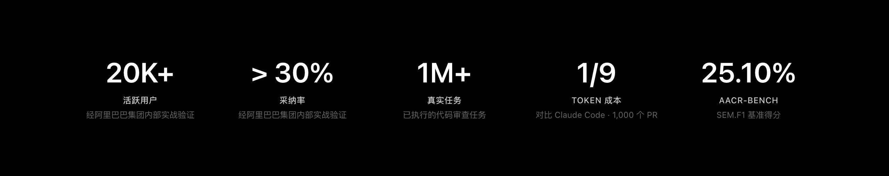
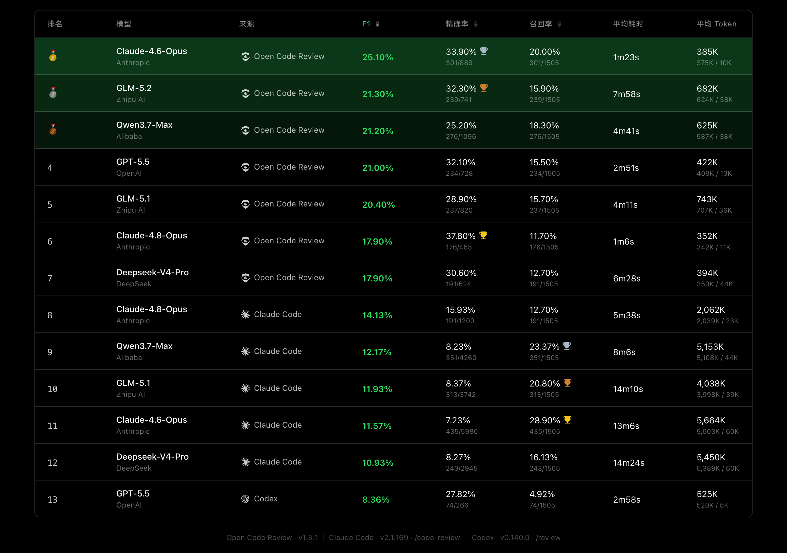

<div align="center">
  <a href="https://open-codereview.ai">
    
  </a>
  <h1>OpenCodeReview</h1>
</div>

<p align="center">
  <a href="https://trendshift.io/repositories/41087?utm_source=repository-badge&amp;utm_medium=badge&amp;utm_campaign=badge-repository-41087" target="_blank" rel="noopener noreferrer">
    
  </a>
  <a href="https://trendshift.io/repositories/41087" target="_blank">
    
  </a>
</p>
<p align="center">
  <a href="https://www.npmjs.com/package/@alibaba-group/open-code-review"></a>
  <a href="https://github.com/alibaba/open-code-review/actions/workflows/release.yml"></a>
  <a href="https://github.com/alibaba/open-code-review/blob/main/LICENSE"></a>
  <a href="https://deepwiki.com/alibaba/open-code-review"></a>
  <a href="https://www.bestpractices.dev/projects/13328"></a>
</p>
<p align="center">
  <a href="#supported-platforms"></a>
  <a href="#supported-platforms"></a>
  <a href="#supported-platforms"></a>
  <a href="#supported-agents"></a>
  <a href="#supported-agents"></a>
  <a href="#supported-agents"></a>
</p>
<p align="center">
  <a href="README.md">English</a> | 简体中文 | <a href="README.ja-JP.md">日本語</a> | <a href="README.ko-KR.md">한국어</a> | <a href="README.ru-RU.md">Русский</a>
</p>

---

## Open Code Review 是什么？

Open Code Review 是一款 AI 驱动的代码审查 CLI 工具。它的前身是阿里集团内部官方 AI 代码审查助手，过去两年在内部服务了数万开发者，识别了数百万个代码缺陷。经过大规模充分验证后，我们将其孵化为开源项目，对社区开放。只需配置一个模型端点即可使用。

它读取 Git diff，通过具备工具调用能力的 Agent 将变更文件发送至可配置的 LLM，生成具有行级精度的结构化审查意见。Agent 可以读取完整文件内容、搜索代码库、检查其他变更文件以获取上下文，从而进行深度审查——而非仅停留在表面的 diff 反馈。除了 diff 审查，`ocr scan` 可以审查整个文件，适用于审计不熟悉的代码库或没有有意义 diff 的目录。

访问[官方网站](https://open-codereview.ai)了解更多信息。



## 基准测试

> 相比通用 Agent（Claude Code），Open Code Review 在相同底层模型下取得了显著更高的 **准确率（Precision）** 与 **F1 综合得分**，同时仅消耗 **约 1/9 的 token**、审查更快。但召回率（Recall）低于通用 Agent——这是以精准度换取低噪声的设计取舍。

基于真实场景的代码审查基准测试，从 **50** 个热门开源仓库中精选 **200** 个真实的 Pull Request，覆盖 **10** 种编程语言——由 80+ 位资深工程师交叉标注验证（共 **1,505** 个标注缺陷）。

| 指标 | 含义 | 为什么重要 |
|------|------|-----------|
| **F1** | 准确率与召回率的调和均值 | 综合衡量审查质量的最佳单一指标 |
| **准确率 (Precision)** | 报告的问题中真正有效的比例 | 越高 = 误报越少，减少人工确认成本 |
| **召回率 (Recall)** | 真实缺陷中被发现的比例 | 越高 = 漏报越少，更多问题不会遗漏 |
| **平均耗时 (Avg Time)** | 每次审查的实际耗时 | 决定 CI 流水线的等待时间 |
| **平均 Token (Avg Token)** | 每次审查消耗的总 token 数 | 直接影响 API 使用成本 |



## 为什么选择 Open Code Review？

### 通用 Agent 的局限

如果你深度用过 Claude Code 等通用 Agent + Skills 方案做代码审查，可能对以下问题深有同感：

- **覆盖不全** —— 变更较大时，Agent 倾向于"偷懒"，选择性地审查部分文件，导致遗漏。
- **位置漂移** —— 报告的问题与实际代码位置常常对不上，出现行号或文件偏移。
- **效果不稳定** —— 基于自然语言驱动的 Skills 难以调试，审查质量因提示词的细微差异而大幅波动。

这些问题的根源在于：纯语言驱动的架构缺乏对审查流程的强约束。

### 核心设计：确定性工程 × Agent 混合驱动

Open Code Review 的核心设计理念是将确定性工程与 Agent 结合，各司其职。

**确定性工程——负责强约束**

对代码审查场景中"不能出错"的环节，由工程逻辑而非语言模型来保证：

- **精准的文件筛选** —— 明确哪些文件需要审查、哪些应当过滤，确保真正重要的改动一个不漏。
- **智能的文件打包** —— 将关联文件归并为同一审查单元（例如 `message_en.properties` 与 `message_zh.properties` 会被打包在一起）。每个包会作为 sub-agent 进行任务，它们之间的上下文是隔离的——这一分治策略在超大变更场景下表现更为稳定，同时天然支持并发审查。
- **精细化规则匹配** —— 针对不同文件的特征，匹配对应的审查规则，确保模型的注意力足够聚焦，从源头规避信息噪声的干扰。相比纯语言驱动的规则引导，基于模板引擎的规则匹配行为更稳定、结果更可预期。
- **外挂的定位与反思组件** —— 独立的评论定位模块与评论反思模块，系统性地提升 AI 反馈的位置准确性与内容准确性。

**Agent——负责动态决策**

将 Agent 的优势集中发挥在它真正擅长的地方——动态决策、动态召回上下文：

- **场景化提示词调优** —— 针对代码审查场景深度优化提示词模板，在提升效果的同时有效降低 Token 消耗。
- **场景化工具集沉淀** —— 基于对大量线上数据中工具调用轨迹的深入分析，包括不同工具的调用频率分布、单一工具的重复调用率、新增工具对整体调用链路的影响等多维度分析，从而对通用 Agent 工具集进行取舍与拆分，最终沉淀出一套在代码审查场景下效果更稳定、行为更可预期的专属工具集。

## 如何使用

### 前置条件

- **Git >= 2.41** — Open Code Review 依赖 Git 进行 diff 生成、代码搜索和仓库操作。

### CLI

#### 安装

```bash
npm install -g @alibaba-group/open-code-review
```

安装后，`ocr` 命令即可全局使用。

其他安装方式（安装脚本、GitHub Release 二进制、源码构建），详见[安装指南](https://open-codereview.ai/docs/installation)。

#### 快速开始

**1. 配置 LLM**

在审查代码之前，必须先配置 LLM。除非你使用[委托模式](https://open-codereview.ai/docs/delegate)。

```bash
ocr config provider          # 选择内置供应商或添加自定义供应商
ocr config model             # 为当前供应商选择模型
```


交互式界面会引导你完成供应商选择、API Key 输入和模型配置，完成后自动测试连通性。

命令行设置、环境变量、自定义供应商等高级配置，详见[配置指南](https://open-codereview.ai/docs/configuration)。

**2. 开始审查**

```bash
cd your-project

# 工作区模式 —— 审查所有暂存、未暂存和未跟踪的变更
ocr review

# 分支范围 —— 比较两个引用
ocr review --from main --to feature-branch

# 单个提交
ocr review --commit abc123

# 恢复中断的区间或单 commit 评审
ocr session list
ocr review --from main --to feature-branch --resume <session-id>

# 全量文件扫描 —— 审查整个文件而非 diff（无需 git 历史）
ocr scan                          # 扫描整个仓库
ocr scan --path internal/agent    # 扫描指定目录或文件

# 委托模式 — 让你的 AI 编程 agent 自己执行评审
# OCR 负责文件选择和规则解析；无需配置 LLM
ocr delegate preview
ocr delegate rule src/main.go src/handler.go
```

## 文档

完整文档见 **[open-codereview.ai/docs](https://open-codereview.ai/docs)**：

- [快速开始](https://open-codereview.ai/docs/quickstart) —— 安装并运行你的第一次评审
- [安装](https://open-codereview.ai/docs/installation) —— 覆盖各平台与包管理器
- [CLI 参考](https://open-codereview.ai/docs/cli-reference) —— 所有命令与参数
- [评审规则](https://open-codereview.ai/docs/review-rules) —— 深度定制规则进行评审，过滤路径、指定路径等
- [配置](https://open-codereview.ai/docs/configuration) —— 配置项与环境变量
- [MCP 服务器](https://open-codereview.ai/docs/mcp) —— 用外部工具扩展评审 agent
- 编程 Agent 集成 —— 将 OCR 集成到 Claude Code、Codex、Cursor 等
  - [Skill](https://open-codereview.ai/docs/agent-skill) —— 作为可复用的 Agent Skill 安装
  - [Plugin](https://open-codereview.ai/docs/claude-code) —— 作为 Claude Code / Codex / Cursor 插件安装
  - [委托模式](https://open-codereview.ai/docs/delegate) —— 让 Agent 使用自身的 LLM 进行评审
- [CI/CD 集成](https://open-codereview.ai/docs/cicd) —— 支持 GitHub Actions、GitLab CI、GitFlic CI、Gerrit 集成
- [会话查看器](https://open-codereview.ai/docs/viewer) —— 在浏览器中浏览和回放评审会话
- [遥测](https://open-codereview.ai/docs/telemetry) —— OpenTelemetry 集成，用于可观测性
- [FAQ](https://open-codereview.ai/docs/faq) —— 常见问题与故障排查

## 贡献

感谢所有为本项目做出贡献的人。参见 [CONTRIBUTING.zh-CN.md](CONTRIBUTING.zh-CN.md) 了解开发环境搭建、编码规范以及如何提交 Pull Request。

<a href="https://github.com/alibaba/open-code-review/graphs/contributors">
  
</a>

## 许可证

[Apache-2.0](LICENSE) — Copyright 2026 Alibaba
