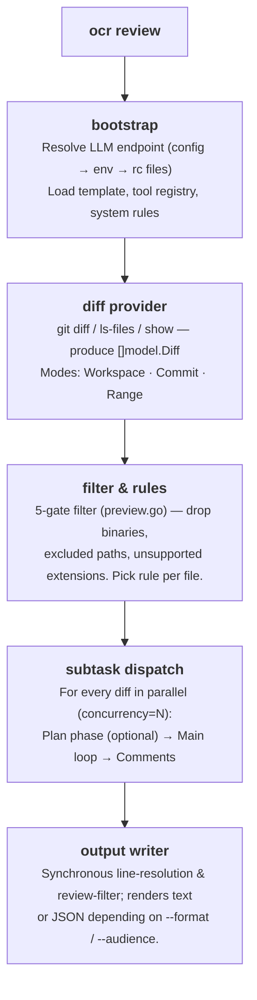
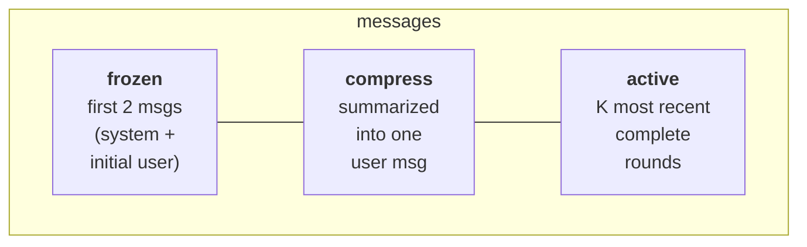

あなたが Enter キーを押してから JSON がターミナルに出力されるまで、`ocr review` が内部で実際にどう動くかのガイドです。挙動をデバッグし、引数をチューニングし、自信を持ってソースコードを読めるだけの十分なメンタルモデルを構築することを目的としています。

## 高レベルのパイプライン



オーケストレーションのロジックは [`internal/agent/`](https://github.com/alibaba/open-code-review/blob/main/internal/agent/) パッケージにあり、4 つのファイルに分かれています: `agent.go`（メインループとディスパッチ）、`compression.go`（メモリ圧縮）、`preview.go`（ファイルフィルタリング）、`util.go`（ヘルパー）。注目すべきエントリポイントは 2 つです: `Agent.Run`（パイプラインの最上部）と `Agent.dispatchSubtasks`（ファイルごとのファンアウト）。

## diff provider

`internal/diff/git.go` は `Provider` 構造体を定義しており、その未エクスポートのフィールド `mode`（型は `Mode`、`int` 列挙体）が、CLI 引数に対応する 3 つのモードのいずれかを選択します:

| モード | トリガー方法 | 返す内容 |
|---|---|---|
| `Workspace` | 引数なし | staged + unstaged + untracked の変更 |
| `Commit` | `--commit <sha>` / `-c <sha>` | `<sha>` が導入した変更（`git show <sha>` 経由。`<sha>^..<sha>` の diff に相当） |
| `Range` | `--from <a> --to <b>` | `merge-base(a, b)..b` |

各 diff は次を保持します: old/new path、old/new hunk、挿入/削除カウント、バイナリフラグ、リネーム検出。`DiffContextLines` は **3** に固定されており、Git のデフォルトと一致します。

untracked ファイルはディスクから読み込まれ、ファイル全体の新規追加として扱われるため、commit 前にレビューできます。

## 5 段階ゲートのファイルフィルタリング

diff の読み込み後、各ファイルは [`whyExcluded`](https://github.com/alibaba/open-code-review/blob/main/internal/agent/preview.go) を通過します。この関数は次のいずれかを返します:

```
binary          — file is binary
user_exclude    — matched a pattern in your `exclude` list
unsupported_ext — extension is not in supported_file_types.json
default_path    — matched a built-in test-file exclude pattern
```

……またはファイルが保持される場合は空を返します。`deleted` は `whyExcluded` からは**返されません**。これは `Preview()` の中でそのあと計算されます。保持されたファイルの diff が `IsDeleted` を報告したときです。各ゲートは以下の順序で実行されます:

1. `binary`: バイナリファイルが最初に破棄されます。
2. `user_exclude`: あなたのプロジェクトの `exclude` が常に優先されます。
3. `user_include`: include パターンが設定されており**かつ**ファイルがそのいずれかに一致する場合、即座に保持され（空を返す）、下記の `unsupported_ext` と `default_path` のゲートをバイパスします。
4. `unsupported_ext` は拡張子のホワイトリストでフィルタリングします。
5. `default_path` は最後のゲートです: 組み込みの**テストファイル**除外パターン（`**/*_test.go`、`**/*.test.{js,jsx,ts,tsx}`、`**/__tests__/**`、`**/*_test.py`、`**/*_spec.rb`、`**/*.test.ets`……）に一致します。各パターンはルートプレフィックスとして `**/` を付けます。

ノイズディレクトリのフィルタリング（`vendor/`、`node_modules/`、`target/`……）は、より早い段階、diff-provider 層で、`internal/diff/git.go` の `providerDirIgnoreDirs` リストを通じて発生します。これらのディレクトリの diff は解析されたあと `filterDiffs` によって除去され、ファイルごとのフィルターに到達することは決してありません。

`ocr review --preview` を実行すると、token を消費せずに完全なフィルタリング結果を確認できます。完全なアルゴリズムは[レビュールール](../review-rules/#how-files-are-filtered)を参照してください。

## ファイルごとのサブタスク: plan + main

フィルタリングを通過した各ファイルについて、OCR はサブエージェントを起動します。各サブエージェントは自身の goroutine 内で実行され、`--concurrency`（デフォルト **8**）によって制限され、独立した LLM メッセージバッファを持ちます。

1 つのサブタスクは最大**2 つの段階**を持ちます:

### 段階 1: Plan（任意）

```go
threshold := template.PlanModeLineThreshold     // 50
changeLines := d.Insertions + d.Deletions
if changeLines < threshold { skip plan }
```

小さな diff に対しては、plan はレイテンシを増やすだけで価値がないため、静かにスキップされ、main ループが直接実行されます。より大きな diff に対しては、OCR は**1 回だけ** `PLAN_TASK` の LLM 呼び出しを行います。`Tools` フィールドを送らないため、plan の間モデルはツールを呼び出せません。読み取り専用ツールのサブセット（`code_search`、`file_read_diff`、`file_find`。`tools.json` で `plan_task` フラグが `true` の 3 つ）が、`{{plan_tools}}` プレースホルダー（`formatToolDefs` でレンダリング）を通じてプレーンテキストとして埋め込まれ、あとで何が使えるかをモデルに知らせます。モデルはチェックリストを返し、それが main prompt 内の `{{plan_guidance}}` になります。

### 段階 2: main ループ

main ループは `MAIN_TASK` prompt を組み立て、モデルとツール呼び出しの対話を展開します。完全なツールセットは、plan 段階のツールに **`task_done`**、**`code_comment`**、**`file_read`** を加えたものです。完全な一覧は[ツール](../tools/)を参照してください。

```
loop up to MAX_TOOL_REQUEST_TIMES (default 30):
    response = llm.complete(messages, tools)
    if response.toolCalls is empty:
        nudge model with "You did not successfully call any tools.
                          Please try again or use task_done if finished."
        continue
    for each call: execute → collect result
    if any call was task_done: break
    addNextMessage(...)              # may trigger compression
```

ループには 5 つの終了条件があります:

1. `task_done` が呼び出された。
2. `MAX_TOOL_REQUEST_TIMES` を使い切った。
3. 有効なツール結果が 3 ラウンド連続で生成されなかった（`maxConsecutiveEmptyRounds = 3`）。
4. context がキャンセルされた。
5. `addNextMessage` が false を返した。圧縮してもメッセージバッファを警告しきい値以下に戻せなかった場合です。

いずれの場合でも、収集済みの `code_comment` 呼び出しがレビューコメントになります。

## メモリ圧縮

長いツール呼び出しループは、最終的にコンテキストウィンドウをあふれさせます。OCR は**3 分割**戦略で管理し、`MAX_TOKENS = 58888` で定義される token 予算でトリガーされます:

| しきい値 | 定数 | 動作 |
|---|---|---|
| MAX_TOKENS の 60% | `tokenSoftThreshold` | **非同期**のバックグラウンド圧縮を起動します。現在のループは中断せず継続します。 |
| MAX_TOKENS の 80% | `tokenWarningThreshold` | 次のリクエストを送る前に**同期的**に圧縮を実行します。 |

### 3 つのゾーン



1「ラウンド」とは、1 つの assistant メッセージと、それに続くツール結果メッセージのことです。`partitionMessages` は末尾から前へラウンドを辿り、`(0.80 × MAX_TOKENS) - reservedTokens` に収まる限り多くのラウンドを保持します。それより前の内容が **compress ゾーン**になります。

compress ゾーンは XML としてレンダリングされ、`MEMORY_COMPRESSION_TASK` prompt でモデルに渡されます。返されたサマリーは、`<previous_review_summary>` タグで包まれて元の user メッセージ内に追記されます。

圧縮後: `messages = frozen[2] + compressed_user_msg + active`。

```go
// compression.go
func (a *Agent) runCompression(ctx context.Context, msgs []llm.Message, filePath string) ([]llm.Message, error) {
    part := partitionMessages(msgs, a.args.Template.MaxTokens, 0)
    contextXML := buildMessageXML(msgs[part.frozenEnd:part.compressEnd])
    // … MEMORY_COMPRESSION_TASK を呼び出す …
    rebuilt[1] = llm.NewTextMessage(role, currentText+
        "\n\n<previous_review_summary>\n"+rawSummary+"\n</previous_review_summary>")
    for i := part.compressEnd; i < len(msgs); i++ {
        rebuilt = append(rebuilt, msgs[i])
    }
    return rebuilt, nil
}
```

### 非同期 vs 同期

非同期パスでは、バックグラウンドで圧縮が実行されている間も main ループがツール呼び出しを生成し続けられます。次の token チェックが発生したとき、準備できたサマリーが `tryApplyPendingCompression` を通じて適用されます。非同期タスクが完了する前に比率が警告しきい値を越えた場合、ループは一時停止して `runCompression` を同期的に実行します。これにより次のリクエストが必ず収まることが保証されます。

## コメント処理パイプライン

各 `code_comment` ツール呼び出しは 1 つ以上の生のコメントを生成します。それらは**CommentWorkerPool**（固定サイズの goroutine プール）を通過し、メインのツール呼び出しループが後処理でブロックされることを防ぎます:

1. **行解決**（worker 内）: `existing_code` をスライディングウィンドウアルゴリズムで diff と照合し、正確な `start_line` / `end_line` を計算します。照合に失敗した場合は両方ともデフォルトで `0` になります。行範囲 `0` は「アンカーされていない」コメントの暗黙のシグナルであり、ユーザーが手動で位置を特定する必要があります（格納されるフラグはありません。下流のコンシューマーが `start_line == 0` をチェックします）。
2. **再配置タスク** *（任意のフォールバック）*: 行解決がより複雑な diff で失敗したとき、OCR は `RE_LOCATION_TASK` prompt を実行し、モデルにスニペットの再アンカーを依頼します。書き換えられた `existing_code` 文字列に有用です。
3. **レビューフィルター**: main ループの終了後（worker プールが空になったあと）、`REVIEW_FILTER_TASK` の LLM 呼び出しが、収集されたコメントを diff と照合してチェックし、明らかに誤りと証明できるコメントを削除します。ここでのエラーは記録されたうえで無視されます。
4. **2 回目の行解決**: `Agent.Run` が戻ったあと、トップレベルのコマンドが完全なコメントセットに対して `diff.ResolveLineNumbers` を再実行します（`cmd/opencodereview/review_cmd.go` を参照）。`existing_code` が複数ファイルにまたがる、あるいは再配置ステップで更新されたコメントを捕捉するためです。
5. **レンダリング**: `--format` に従って text または JSON にレンダリングします。

## token 予算ガード

LLM を呼び出す前に、OCR はまず fail-fast のチェックを行います:

```go
tokenLimit := MaxTokens * 4 / 5     // 80 %
if countMessagesTokens(messages) > tokenLimit {
    record warning "token_threshold_exceeded"
    return nil      // skip this file
}
```

これにより、巨大な diff（自動生成された lock ファイル、数千行に触れるリファクタリング）がリクエストを消費する前にそれらを食い止めます。スキップされたファイルは致命的でない警告として stdout に報告され、JSON の `warnings` 配列に追加されます。

2 つ目のチェックは `filterLargeDiffs` の中で実行されます: diff が単独で `MAX_TOKENS` の 80% を超える場合、ファイルごとのディスパッチャーが起動する前にフィルタリングで除去されます。

## テンプレートとプレースホルダー

`internal/config/template/task_template.json` には**5 つの prompt** が含まれます:

| Key | 用途 |
|---|---|
| `PLAN_TASK` | plan 段階。チェックリストを生成します。 |
| `MAIN_TASK` | main レビューループ。`code_comment` 呼び出しを発行します。 |
| `MEMORY_COMPRESSION_TASK` | compress ゾーンを要約します。 |
| `REVIEW_FILTER_TASK` | ループ後に、明らかに誤りと証明できるコメントを削除する処理。 |
| `RE_LOCATION_TASK` | `existing_code` を照合できないコメントを再アンカーします。 |

各 prompt は `{role, prompt_file}` 参照のリストで、テンプレートディレクトリ内の `.md` ファイルを指します（例: `{"role": "system", "prompt_file": "main_task_system.md"}`）。読み込み時に `resolveConversation` がこれらのファイルをメモリ内の `{role, content}` メッセージに読み込み、その後テンプレートのプレースホルダーがファイルごとに解決されます:

| プレースホルダー | 置換される内容 |
|---|---|
| `{{system_rule}}` | 4 層チェーンから解決されたルール本文。 |
| `{{change_files}}` | PR 内の他の各変更ファイルの状態 + パス。 |
| `{{diff}}` | このファイルの diff（生の `git diff` 出力）。 |
| `{{current_file_path}}` | このファイルの新しいパス。 |
| `{{plan_guidance}}` | plan 段階の出力。plan がスキップされた場合は削除されます。 |
| `{{plan_tools}}` | plan 段階のツール定義のプレーンテキスト（`formatToolDefs` でレンダリング）。`PLAN_TASK` の system prompt に使用されます。 |
| `{{requirement_background}}` | `--background` 引数の内容。 |
| `{{current_system_date_time}}` | 実行時のローカルタイムスタンプ。形式は `YYYY-MM-DD HH:MM`（秒やタイムゾーンなし）。 |
| `{{context}}` | （圧縮時のみ）要約対象の XML レンダリング済みメッセージ。 |
| `{{path}}` | ファイルパス。`REVIEW_FILTER_TASK` に使用されます。 |
| `{{comments}}` | 蓄積されたコメント（JSON）。`REVIEW_FILTER_TASK` に使用されます。 |

プレースホルダーの置換は [`agent.go`](https://github.com/alibaba/open-code-review/blob/main/internal/agent/agent.go) にあります。テンプレート自体は CLI では上書きできません。prompt を変更するには、[`task_template.json`](https://github.com/alibaba/open-code-review/blob/main/internal/config/template/task_template.json) を編集して再ビルドする必要があります。`--tools` 引数は*ツールレジストリ*の上書きです（`internal/config/toolsconfig` が消費する JSON を置き換えます）。テンプレートの上書きではありません。[ツール](../tools/#customizing-tools)を参照してください。

> **プレースホルダー構文についての注意。** 上記のプレースホルダーはすべて二重波括弧 `{{…}}` 構文を使用します。*ただし* `RE_LOCATION_TASK` は例外で、単一波括弧の `{diff}`、`{existing_code}`、`{suggestion_content}` を置換します（`internal/diff/relocation.go` を参照）。

## 永続化

各レビューは JSONL としてディスクに書き込まれます:

```
~/.opencodereview/sessions/<encoded-repo-path>/<session-id>.jsonl
```

リポジトリパスは base64 エンコード**されません**。`encodeRepoPath`（`internal/session/persist.go` 内）が `/` と `\` を `-` に、`:` を `_` に置換し、パスをファイルシステムで安全にします。

各行は 1 つのイベントです: 送信された prompt、LLM レスポンス、ツール呼び出し、ツール結果、発行されたコメントなど。Web UI（`ocr viewer`）はこれらのファイルを直接読みます。データベースはなく、append-only のログだけです。UI ガイドとイベント schema は[セッションビューア](../viewer/)を参照してください。

## テレメトリ

テレメトリを有効にすると、agent は 3 つのパイプラインレベルの span を発行します（`review.run` はジョブ全体を包み、`diff.parse` は diff の読み込みを包み、レビューされた各ファイルにつき 1 つの `subtask.execute.<file>`）。加えて、各決定ポイントで短命な `event.<name>` span を発行します（`plan.skipped`、`token.threshold.exceeded`、`subtask.error`……）。LLM の往復とツール呼び出しは metrics としてのみ記録され、span としては記録されません。prompt とレスポンスの内容がテレメトリに添付されることは**決してありません**。`OCR_CONTENT_LOGGING` フラグは配線済みですが、現在はデッドコードです。完全な schema は[テレメトリ](../telemetry/)を参照してください。

## *自動化されない*もの

一部の決定は意図的に手動のままにされています:

- **エンドポイント発見にフォールバックはありません。** config + env + rc ファイルが完全な `(URL, token, model)` の三つ組を与えられない場合、OCR は推測するのではなく非ゼロコードで終了します。
- **サブエージェントの失敗は隔離され、リトライされません。** 1 つの失敗したファイルは 1 つの警告を生成し、残りは継続します。リトライは、それを包む CI パイプラインの責務であり、agent の責務ではありません。
- **クロスファイルの推論はありません。** 各ファイルはそれ自身の LLM 対話でレビューされます。ファイルをまたぐ問題は `file_read_diff` / `code_search` ツール呼び出しを通じて扱われ、共有コンテキストは使いません。それら*他の*ファイルで見つかった問題をコメント対象にすることも禁止されています。`main_task` prompt は、コンテキストツールを理解のためだけに使い、現在の diff の外にあるファイルで見つかった問題は無視するようモデルに指示します。

これらの選択により、実行は**ファイルごとに決定的**になり、コストが予測可能になります。

## ソースコードマップ

対照しながら読みたい場合:

| 関心事 | ファイル |
|---|---|
| トップレベルのコマンドディスパッチ | `cmd/opencodereview/main.go` |
| `review` の引数解析 | `cmd/opencodereview/flags.go` |
| agent のオーケストレーションと圧縮 | `internal/agent/`（agent.go、compression.go、util.go） |
| ファイルフィルタリング / プレビュー | `internal/agent/preview.go` |
| diff の読み込み（Git モード） | `internal/diff/git.go` |
| ルール解決チェーン | `internal/config/rules/system_rules.go` |
| ツールレジストリと実装 | `internal/tool/` |
| LLM エンドポイントリゾルバ | `internal/llm/resolver.go` |
| セッション JSONL ライター | `internal/session/persist.go` |
| Web ビューア | `internal/viewer/server.go` |

ビルドとテストの説明は[コントリビュート](../contributing/)を参照してください。

## 関連項目

- [ツール](../tools/): agent ループが呼び出す 6 種類のツール。
- [レビュールール](../review-rules/): ファイルごとのルールテキストがどう解決されるか。
- [セッションビューア](../viewer/): このパイプラインが書き出したトランスクリプトを確認します。
